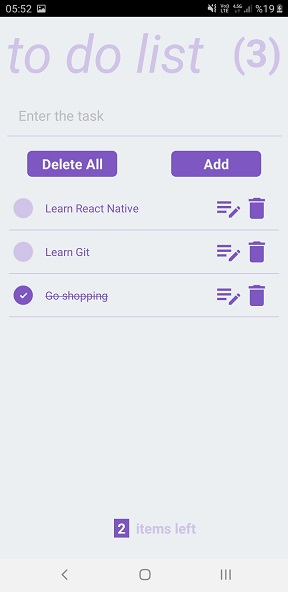

# to do list

- With this app you can create your own to do list.
- All tasks can be deleted with a single button.

# used in this project:
- React Navigation
- React Redux (Redux Toolkit)
- Creating Custom Component
- Material Icon Package

- Task can be marked as complete.

- Task can be edited or deleted.

